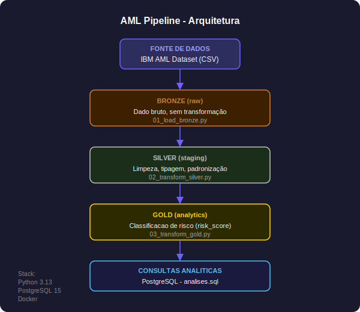

# AML Pipeline - Detecção de Lavagem de Dinheiro

Pipeline de engenharia de dados para processamento e classificação de transações financeiras suspeitas, aplicando a arquitetura Medallion (Bronze, Silver e Gold) com Python e PostgreSQL.

---

## Problema

O time de Compliance de uma fintech não conseguia detectar padrões de lavagem de dinheiro em tempo hábil. Os analistas recebiam os dados no dia seguinte, em planilha, sem classificação de risco.

Este pipeline automatiza o processamento e entrega os dados classificados por risco toda madrugada, antes do início do expediente.

---

## Fonte de Dados

IBM Transactions for Anti Money Laundering (AML) - NeurIPS 2023
Fonte: https://www.kaggle.com/datasets/ealtman2019/ibm-transactions-for-anti-money-laundering-aml
Arquivo utilizado: `HI-Small_Trans.csv` com 1.048.575 transações.

| Coluna | Descrição |
|---|---|
| Timestamp | Data e hora da transação |
| From Bank / Account | Conta de origem |
| To Bank / Account | Conta de destino |
| Amount Paid / Received | Valor e moeda |
| Payment Format | Canal de pagamento |
| Is Laundering | 0 = legítima, 1 = lavagem confirmada |

---

## Arquitetura



```

**Por que batch e não streaming?**
O Compliance trabalha de manhã. Não é necessário dado em tempo real. Basta garantir que os dados estejam prontos e classificados antes do início do expediente, o que torna o processamento batch a escolha mais simples e adequada.

---

## Decisões de Arquitetura

**Por que PostgreSQL?**
O volume do dataset (1 milhão de transações) cabe confortavelmente em um banco relacional. PostgreSQL oferece suporte robusto a tipos de dados, índices e queries analíticas sem a necessidade de infraestrutura distribuída. Para um pipeline batch de compliance, é a escolha mais prática e direta.

**Por que Python puro sem Airflow?**
O pipeline tem uma sequência linear de três etapas sem dependências externas ou schedules complexos. Adicionar Airflow nesse contexto seria over-engineering. O orquestrador certo para esse caso é um cron job ou um script único de execução sequencial.

**Por que Medallion Architecture?**
Separar Bronze, Silver e Gold garante rastreabilidade. Se uma transformação produzir dados errados, é possível reprocessar a partir da camada anterior sem precisar reingesta os dados brutos. Em compliance isso é fundamental.

---

## Stack

- Python 3.13
- PostgreSQL 15 (Docker)
- psycopg2
- pandas

---

## Estrutura

```
aml-pipeline/
├── docker-compose.yml
├── run_pipeline.py
├── pipeline/
│   ├── 01_load_bronze.py
│   ├── 02_transform_silver.py
│   └── 03_transform_gold.py
└── sql/
    └── analises.sql
```

---

## Como Executar

Pré-requisitos: Docker e Python 3.10+

```bash
# 1. Clone o repositório
git clone https://github.com/luciendelalves/aml-pipeline.git
cd aml-pipeline

# 2. Baixe o dataset e coloque na raiz do projeto
# https://www.kaggle.com/datasets/ealtman2019/ibm-transactions-for-anti-money-laundering-aml

# 3. Instale as dependências
pip install pandas psycopg2-binary

# 4. Suba o banco
docker compose up -d

# 5. Execute o pipeline completo
python run_pipeline.py
```

---

## Qualidade de Dados

Antes das transformações, o pipeline valida:

```python
# Verificar nulos em colunas críticas
assert df['Timestamp'].isnull().sum() == 0, "Nulos encontrados em Timestamp"
assert df['Is Laundering'].isnull().sum() == 0, "Nulos encontrados em Is Laundering"

# Verificar duplicatas
assert df.duplicated().sum() == 0, "Duplicatas encontradas no dataset"

# Validar domínio da coluna alvo
assert df['Is Laundering'].isin([0, 1]).all(), "Valores inválidos em Is Laundering"
```

---

## Camada Gold - Sinais de Risco

Cada transação recebe um `risk_score` baseado em três sinais:

| Sinal | Critério | Peso |
|---|---|---|
| Canal de risco | ACH, Cheque, Credit Card, Cash, Bitcoin | +1 |
| Conversão de moeda | payment_currency diferente de received_currency | +1 |
| Horário atípico | Entre 0h e 5h | +1 |

---

## Queries Analíticas

```sql
-- Distribuição de lavagem por canal de pagamento
SELECT
    payment_format,
    COUNT(*) AS total_transacoes,
    SUM(is_laundering) AS total_lavagem,
    ROUND(100.0 * SUM(is_laundering) / COUNT(*), 2) AS pct_lavagem
FROM gold_transactions
GROUP BY payment_format
ORDER BY pct_lavagem DESC;

-- Conta de maior risco
SELECT
    from_account,
    from_bank,
    COUNT(*) AS total_transacoes,
    SUM(amount_paid_usd) AS total_movimentado,
    SUM(is_laundering) AS confirmados_lavagem
FROM gold_transactions
GROUP BY from_account, from_bank
HAVING SUM(is_laundering) = COUNT(*)
ORDER BY total_movimentado DESC
LIMIT 10;

-- Distribuição de lavagem por horário
SELECT
    EXTRACT(HOUR FROM timestamp) AS hora,
    COUNT(*) AS total_transacoes,
    SUM(is_laundering) AS total_lavagem
FROM gold_transactions
GROUP BY hora
ORDER BY hora;
```

---

## Descobertas Analíticas

Os sinais de risco foram calibrados com base nos próprios dados e contrariaram o senso comum de PLD:

**Canal de pagamento:** Wire e Cash, tradicionalmente considerados de alto risco, têm zero lavagem confirmada neste dataset. O canal ACH concentra 83% dos casos. Criminosos se ocultam no alto volume de transações legítimas.

**Horário:** A lavagem não ocorre na madrugada. Os picos estão nos horários comerciais normais, dificultando a detecção por regras de horário.

**Conversão de moeda:** 100% dos casos confirmados ocorrem sem conversão de moeda. Operadores sofisticados evitam sinais óbvios.

**Conta de maior risco:** A conta `100428660` (banco 070) movimentou mais de R$ 34 milhões com 100% das transações confirmadas como lavagem.

---

## Autor

Luciendel Alves
Analista de Risco e PLD 
LinkedIn: https://www.linkedin.com/in/luciendelalves
